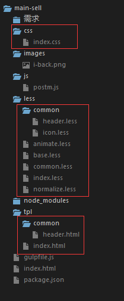

By lxl

------

> `Gulp` 入门教程 + 实战，主要说明目前我们前端组用的 `Gulpfile.js`里面所包含的插件

------

## 使用Gulp 的步骤
- 安装 `nodejs` -> 全局安装 `Gulp` -> 项目安装 `Gulp`以及 `gulp`插件 —> 配置`gulpfile.js` -> 运行任务
- 这里不想多说 Gulp 安装，详情看 [一点| gulp详细入门教程](http://www.ydcss.com/archives/18/comment-page-6)，非常好的教程

### 注意点
-  `Gulpfile`文件的文件名貌似就该是 `gulpfile.js`，不要问我为什么，我也不知道为什么改了其他名字就不行了

### 下面是 我们前端组目前比较通用的  `gulpfile.js`，加个人修改后完成
- 以 项目 `static-pages/main-sell`为例子，打开项目根据目录去看更好理解



- 加上了注释和文档,去掉了注释其实不多东西的
`````javascript
//npm i gulp gulp-less gulp-file-include gulp-sourcemaps less-plugin-autoprefix stream-combiner2 browser-sync http-proxy --save-dev

var gulp = require('gulp');
var less = require('gulp-less');

//gulp-file-include：把公用的 header、footer 等引入到页面中，类似java的 include 方法
//文档：https://github.com/coderhaoxin/gulp-file-include
var fileinclude = require('gulp-file-include');

// sourcemaps：用来调试代码的，比如你压缩了JS，打开Chrome控制台（其他貌似浏览器不支持）就能看到未压缩的代码
// less生成CSS，调试的时候 Chrome会把解析CSS成less，非常方便
//文档：https://www.npmjs.com/package/gulp-sourcemaps
var sourcemaps = require('gulp-sourcemaps');

// less-plugin-autoprefix：为 less 添加浏览器前缀
// 注意 `last 3 versions`，设为低于3有些属性没有-webkit—前缀，比如 flexbox 布局属性 
// 文档：http://www.ydcss.com/archives/94
var LessAutoprefix = require('less-plugin-autoprefix'),
    autoprefix = new LessAutoprefix({ browsers: ['last 3 versions']});

//默认情况下，在 stream中 发生一个错误的话，它会被直接抛出，除非已经有一个时间监听器监听着 error 事件
//这在处理一个比较长的管道操作的时候会显得比较棘手
//通过使用 stream-combiner2 ，你可以将一系列的 stream 合并成一个
//这意味着，你只需要在你的代码中的一个地方添加一个监听器听 error 事件即可
//文档： http://www.gulpjs.com.cn/docs/recipes/combining-streams-to-handle-errors/
//类似的插件还有 plumber 插件
var combiner = require('stream-combiner2');

// 超好用的插件，既可以开启静态服务器、代理服务器，还可以同步所有浏览器操作
// 关键是还可以　remote debug，内置了 weinre
// 但有一个注意点是，打开 remote debug 之前先打开要调试的网页
// http://blog.csdn.net/u012038144/article/details/46641383
var browserSync = require('browser-sync').create(),
    reload = browserSync.reload;

// 代理服务器插件
// https://www.npmjs.com/package/http-proxy
var httpProxy = require('http-proxy'),
    proxy = httpProxy.createProxyServer({});

var paths = {
    base: './', // 为当前目录
    tplFilter: ['tpl/*.*'], // '*.*' 匹配tpl文件夹的任何文件/文件夹 
    tpl: ['tpl/**'],
    html: ['./*.html'], // './*.html' 匹配当前目录下的 html文件
    less: ['less/**'],
    lessFilter: ['less/**', '!less/base*',  '!less/normalize*', '!less/animate*', '!less/common/**', '!less/common*'] 
    //切记别写成 '!less/common'
};


//开启静态服务器，并设置代理，不要代理就去掉 'middleware' 属性就好
// browser-sync 文档：http://www.browsersync.cn/docs/gulp/
gulp.task('serve-watch', function(){
    browserSync.init({
        server: {
            baseDir: './',     //Serve files from the current directory with directory listing
            directory: true,
            middleware: [      //设置中间件，代理
                function(req, res, next) {
                    if(/thpcluster/i.test(req.url)){
                          proxy.web(req, res, { target: 'http://192.183.3.91/' }, function(e){
                            console.log(e);  //捕获错误，不然 server 会断开
                          });

                    }
                    else{
                        next();
                    }
                }
            ],
        },
        open: true, //开启服务器之后是否自动打开浏览器
        reloadDelay: 500,  
        //Time, in milliseconds, to wait before instructing the browser to reload/inject following a file change event
    });
    gulp.watch(paths.less, ['less']);
    gulp.watch(paths.tpl, ['html']);
});

gulp.task('html', function(){
    var combined = combiner.obj([
            gulp.src(paths.tplFilter),
            fileinclude({
                prefix: '@@',
                basepath: '@file', // @file为当前文件位置，也可以是 @root，表示gulp启动的位置
                indent: true,   //是否缩进
            }),
            gulp.dest(paths.base),
            browserSync.stream({ once: true }), //限制每个 stream 只 重载（reload）一次 
        ]);
    combined.on('error', console.error.bind(console));
    return combined;
});

gulp.task('less', function(){
    var combined = combiner.obj([
            gulp.src(paths.lessFilter),
            sourcemaps.init(),
            less({ plugins: [autoprefix]}),
            sourcemaps.write(),
            gulp.dest(paths.base + 'css'),
            browserSync.stream({ once: true }),
        ]);
    combined.on('error', console.error.bind(console));
    return combined;
});

gulp.task('default', ['less', 'html', 'serve-watch', ]);
gulp.task('build', ['less', 'html']);
`````
