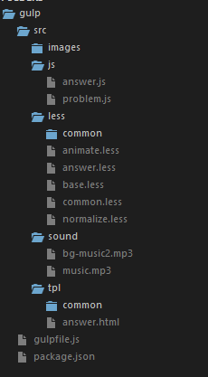

By lxl

------

> *Gulp实战* 加强版，前端需要的功能基本上都用了，需结合 [Gulp实战](http://worldtree.click/2016/08/19/Gulp-%E5%AE%9E%E6%88%98/)篇一起观看

------

## 这个脚手架有什么用呢
首先，还是分本地版src和发布版dist来说吧

### 本地版
1. 开启静态服务器、设置代理服务器，监听less、html、js文件内容实现热加载
1. 实现类似于 java 后端的 include 功能
1. less插件的使用、less文件转化为一个css文件，并注入 sourcemaps到css文件中
1. 合并本地js文件到一个js文件（如main.js）

### 发布版
1. CSS文件和JS文件进行MD5处理
1. CSS文件进行压缩处理，大小减少一半多,并且没有注入sourcemaps
1. JS文件进行压缩处理
1. 根据dist需要的其他静态资源（如images文件夹中的图片、sound文件夹中的音频）从src转移过来

## 怎么用
- 首先，你得先建个类似于下图的文件夹

- 用 `gulp default`或 `gulp` 就可以使用本地版咯
- 最后，用 `gulp dist` 就可以生成发布版dist文件夹咯，压缩一下就可以生成`dist.rar`发给部署人员去部署到服务器啦，是不是很方便

## 最后，献上我的代码
````javascript
var gulp = require('gulp');
var less = require('gulp-less');
var fileinclude = require('gulp-file-include');
var sourcemaps = require('gulp-sourcemaps');

var LessAutoprefix = require('less-plugin-autoprefix'),
    autoprefix = new LessAutoprefix({ browsers: ["Android 4.1", "iOS 7.1", "Chrome > 31", "ff > 31", "ie >= 10"]});
var LessPluginCleanCSS = require('less-plugin-clean-css'),
    cleanCSSPlugin = new LessPluginCleanCSS({advanced: true});

var combiner = require('stream-combiner2');

var browserSync = require('browser-sync').create(),
    reload = browserSync.reload;

var httpProxy = require('http-proxy'),
    proxy = httpProxy.createProxyServer({});

//压缩合并JS
//文档：http://www.gowhich.com/blog/621，随便找的，想看就看
var uglify = require('gulp-uglify'),
    concat = require('gulp-concat');

//删除文件
//文档：http://www.gulpjs.com.cn/docs/recipes/delete-files-folder/
var del = require('del');
    vinylPaths = require('vinyl-paths');

//文件MD5处理
//文档：https://segmentfault.com/a/1190000002932998
var rev = require('gulp-rev'),
    revCollector = require('gulp-rev-collector');

var paths = {
    base: './', // 为当前目录
    tplFilter: ['src/tpl/*.*'], // *.* 匹配 任何名字的任何文件 
    tpl: ['src/tpl/**'],
    jsFilter: ['src/js/**','!src/js/main.js'],
    less: ['src/less/**'],
    lessFilter: ['src/less/**', '!src/less/base*',  '!src/less/normalize*', '!src/less/animate*', '!src/less/common/**', '!src/less/common*'],
};

//npm i gulp gulp-less gulp-file-include del vinyl-paths gulp-sourcemaps 
// less-plugin-autoprefix stream-combiner2 gulp-uglify gulp-concat gulp-rev 
// gulp-rev-collector less-plugin-clean-css browser-sync http-proxy --save-dev

//开启静态服务器，并设置代理
gulp.task('serve-watch', function(){
    browserSync.init({
        server: {
            baseDir: './',     
            directory: true, 
        },
        open: false,
        reloadDelay: 500
    });
    gulp.watch(paths.less, ['less']);
    gulp.watch(paths.tpl, ['html']);
    gulp.watch(paths.jsFilter,['js']);
});

gulp.task('html', function(){
    var combined = combiner.obj([
            gulp.src(paths.tplFilter),
            fileinclude({
                prefix: '@@',
                basepath: '@file', // @file为当前文件位置，也可以是 @root，表示gulp启动的位置
                indent: true,   //是否缩进
            }),
            gulp.dest('./src'),
            browserSync.stream({ once: true }), //限制每个 stream 只 重载（reload）一次 
        ]);
    combined.on('error', console.error.bind(console));
    return combined;
});

gulp.task('less', function(){
    var combined = combiner.obj([
            gulp.src(paths.lessFilter),
            sourcemaps.init(),
            less({ plugins: [autoprefix]}),
            sourcemaps.write(),
            gulp.dest('src/css'),
            browserSync.stream({ once: true }),
        ]);
    combined.on('error', console.error.bind(console));
    return combined;
});

gulp.task('dist-less', ['del'], function(){
    var combined = combiner.obj([
            gulp.src(paths.lessFilter),
            less({ plugins: [autoprefix,cleanCSSPlugin]}),
            rev(), //MD5文件
            gulp.dest('./dist/css'),
            rev.manifest(), //生成manifest文件
            gulp.dest('./src/rev/css'), //存在manifest文件目录
        ]);
    combined.on('error', console.error.bind(console));
    return combined;
});

//合并压缩JS
gulp.task('js', function(){
    var combined = combiner.obj([
            gulp.src(paths.jsFilter),
            concat('main.js'),
            gulp.dest('src/js'),
            browserSync.stream({ once: true }),
        ]);
    combined.on('error', console.error.bind(console));
    return combined;
});

gulp.task('dist-js', ['del'], function(){
    var combined = combiner.obj([
            gulp.src('src/js/main.js'),
            uglify(),
            rev(),
            gulp.dest('./dist/js'),
            rev.manifest(),
            gulp.dest('./src/rev/js'),
        ]);
    combined.on('error', console.error.bind(console));
    return combined;
});

//MD5处理
gulp.task('rev', ['dist-less','dist-js'], function(){
    var combined = combiner.obj([
            gulp.src(['./src/rev/**/*.json', './dist/*.html']), //对html里的文件名替换为带MD5名
            revCollector({
                replaceReved: true,
            }),
            gulp.dest('./dist')
        ]);
    combined.on('error', console.error.bind(console));
    return combined; 
});

//每次生成MD5文件之前都要先清除原本就存在的MD5文件
gulp.task('del', function(){
    return gulp.src(['dist/js/*.*','dist/css/*.*'])
        .pipe(vinylPaths(del));
});

//将src文件夹中的一些资源转移到dist文件夹
gulp.task('add', function(){
    return gulp.src(['src/**', '!src/css/**','!src/less','!src/less/**','!src/js/**','!src/tpl',
        '!src/rev','!src/rev/**','!src/tpl/**'],{base: './src'})
     .pipe(gulp.dest('dist'));
});


gulp.task('default', ['less', 'html','js','serve-watch']);
gulp.task('dist', ['add','del','dist-less', 'dist-js','rev']);
````

## 结束语
谢谢观看
